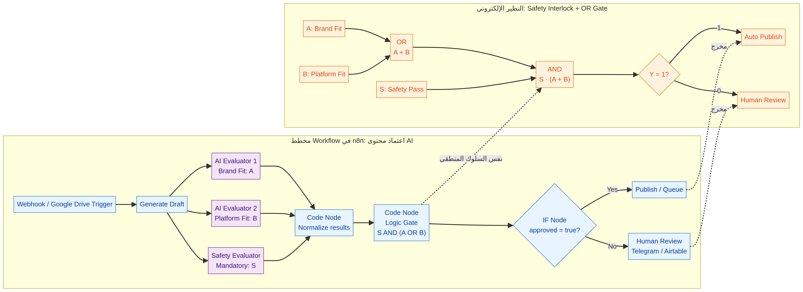

# Safety Interlock Content Approval

## الفكرة

هذا المثال يوضح Workflow ذكيًا في n8n لاعتماد محتوى مولّد بالذكاء الاصطناعي قبل نشره. ينتج النظام مسودة محتوى، ثم يقيّمها عبر ثلاث إشارات: ملاءمة العلامة التجارية `A`، ملاءمة المنصة `B`، وفحص الأمان الإلزامي `S`.

لا يسمح النظام بالنشر إلا عندما يتحقق الشرط:

```text
Y = S AND (A OR B)
```

أي أن فحص الأمان يجب أن ينجح دائمًا، ويكفي نجاح أحد فحصي الملاءمة. إذا لم يتحقق الشرط، ينتقل المحتوى إلى المراجعة البشرية.

## الملفات

| الملف | الوظيفة |
|---|---|
| `workflow.json` | Workflow تجريبي قابل للاستيراد إلى n8n. |
| `n8n-and-logic-diagram.mmd` | مصدر Mermaid للمخططين. |
| `n8n-and-logic-diagram.png` | صورة تجمع مخطط n8n والنظير الإلكتروني. |

## المخطط



الجزء السفلي يمثل Workflow في n8n. الجزء العلوي يمثل دائرة **Safety Interlock + OR Gate**. بوابة `OR` تجمع فحصي الملاءمة، ثم تربط النتيجة ببوابة `AND` مع فحص الأمان الإلزامي.

## مطابقة العناصر

| n8n | المنطق الإلكتروني | الدور |
|---|---|---|
| `AI Evaluator 1` | `A` | فحص ملاءمة العلامة التجارية |
| `AI Evaluator 2` | `B` | فحص ملاءمة المنصة |
| `Safety Evaluator` | `S` | فحص أمان لا يمكن تجاوزه |
| `Normalize AI Signals` | تطبيع الإشارات | تحويل النتائج إلى Boolean |
| `Safety Interlock Logic Gate` | `S AND (A OR B)` | حساب قرار الاعتماد |
| `IF Approved?` | مفتاح الخرج | اختيار النشر أو المراجعة |
| `Publish Queue` | `Y = 1` | مسار النشر أو الطابور |
| `Human Review` | `Y = 0` | مسار المراجعة البشرية |

## تجربة Workflow

استورد `workflow.json` من قائمة الاستيراد في n8n وشغّله عبر `Manual Trigger`. البيانات التجريبية مضبوطة على `A = true` و`B = false` و`S = true`، ولذلك تكون النتيجة `AUTO_PUBLISH`.

لتجربة مسار المراجعة، غيّر `safetyPass` إلى `false`. حتى إذا جعلت فحصي الملاءمة صحيحين، سيبقى القرار `HUMAN_REVIEW` لأن الأمان شرط إلزامي. ويمكنك أيضًا جعل `brandFit` و`platformFit` كلاهما `false` مع إبقاء `safetyPass` صحيحًا لرؤية فشل الملاءمة.

## تحويل المثال إلى استخدام حقيقي

استبدل عقدة `AI Evaluation Demo` بفروع تستدعي نماذج الذكاء الاصطناعي أو خدمات التقييم. يجب أن تُرجع الفروع قيمًا موحدة مثل `pass` و`score` و`reason`. ثم أبقِ منطق القرار داخل عقدة مستقلة حتى يمكن تغيير النماذج دون تغيير سياسة الاعتماد.

استبدل `Publish Queue` بخدمة نشر أو child workflow، واستبدل `Human Review` برسالة Telegram أو سجل Airtable أو نظام موافقات. في بيئة الإنتاج، احفظ `contentId` ونسخة التقييم ووقت القرار لمنع النشر المكرر وتسهيل التدقيق.

> هذا المثال تعليمي. تشبيه الدائرة يوضح سلوك القرار، لكنه لا يغني عن حماية Credentials، والتحقق من صلاحيات الخدمات، وإضافة Retry وTimeout وRate Limit ومراقبة تنفيذية مناسبة.
